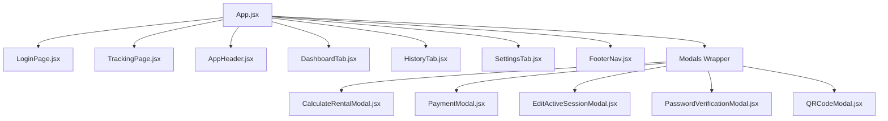

# Specs: EVREN HOUSE Kasir App React Rewrite

- **Date**: 2026-07-14
- **Status**: Draft
- **Target Branch**: `no-sw`

---

## 1. Background & Scope

This specification details the rewrite of the **EVREN HOUSE Kasir POS web application** from its original Vanilla JS, HTML, and CSS stack to a **Vite + React (JavaScript/JSX)** stack. 

### Key Constraints:
- **No Service Worker**: Service Worker caching is completely removed (preventing cached asset locking). The browser should immediately receive updates from Vercel deployments.
- **1:1 Visual Alignment**: The existing Vanilla `style.css` (36KB) must be preserved exactly and imported globally, ensuring fonts, responsive layouts, colors, card layouts, modal designs, and receipt print sheets align pixel-for-pixel with the original.
- **Plain JavaScript (JSX)**: No TypeScript; keeping it simple and direct to map vanilla logic.
- **Supabase Integration**: Maintain real-time syncing of active sessions, transactions, settings, and item images.

---

## 2. Component Architecture & State Structure

The application will be restructured into a component hierarchy:

### State Management (`App.jsx`)
All states previously held in global variables or `localStorage` will reside in React State:
- `activeSessions` (array of active rentals)
- `transactions` (array of finalized transaction logs)
- `selectedQty` (object mapping item code to current dashboard quantity selections)
- `adminPassword` (admin override passcode)
- `currentShiftUser` (logged-in cashier name)
- `shiftQueueNo` (current queue number, resets on shift logout)
- `theme` ('dark' | 'light')
- `supabaseConnected` (connection status boolean)
- `sbLastSync` (date/time of last pull/push)

---

## 3. Detailed Features Porting

### A. Overtime Calculation (with True 10:59 Tolerance)
- Calculations in `CalculateRentalModal.jsx` will match the recent fix:
  - If rental duration is under `limitMinutes + 11` (meaning up to 10 minutes and 59 seconds overtime), no overtime cost is charged.
  - Overtime charges trigger at exactly the 11th minute (minute 11 onwards).
  - Status labels show "Over Xm — toleransi" for minutes 1 to 10, and switch to "Over Xm" with warning colors at minute 11+.

### B. Shift Queue Number
- A state `shiftQueueNo` is initialized from `localStorage.kw_shiftQNo` (or defaults to `0`).
- Every new rental increments `shiftQueueNo` by 1.
- `shiftQueueNo` is saved to `localStorage` and sent with the session details.
- When cashiers end their shift (logout), `shiftQueueNo` is reset to `0` and removed from `localStorage`.
- Struck layouts display `"Queue Number: {queueNo}"` without padding or custom formatting.

### C. Supabase Real-time Syncing
- Establish connection on load.
- Listen for database updates via Supabase broadcast channels for real-time synchronization between active terminals.

---

## 4. CSS & Styling Execution
- The file `/backup-vanilla/style.css` will be copied to `/src/index.css` and imported globally in `/src/main.jsx`.
- Bootstrap 5, Bootstrap Icons, Montserrat and Inter fonts will be kept as CDN links in the root `index.html`.
- Global libraries (SheetJS, QRCode.js) will be loaded via script tags in `index.html` to avoid wrapping complexities, while `@supabase/supabase-js` is imported as an npm package.

---

## 5. Verification Plan

1. **Verify Setup**: Run local dev server (`bun dev` or `npm run dev`) and check for bundler errors.
2. **Visual Checks**: Compare all UI components (Login card, dashboard cards, modal layout, history tables) side-by-side with vanilla.
3. **Logic Checks**:
   - Verify starting a rental increments queue number.
   - Verify completing a rental at 10 minutes past limit doesn't charge OT. At 11 minutes it does.
   - Verify logout resets queue number.
4. **Build Check**: Run `npm run build` to verify production assets compile correctly.
